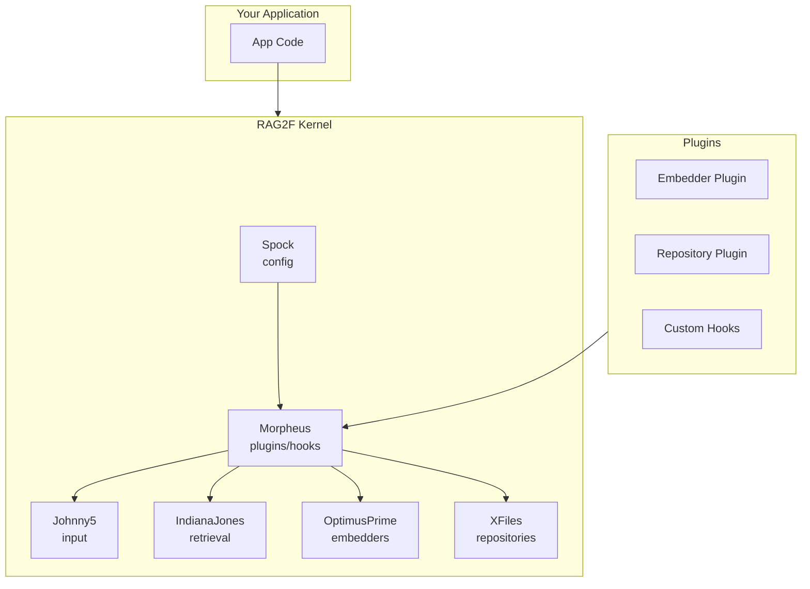
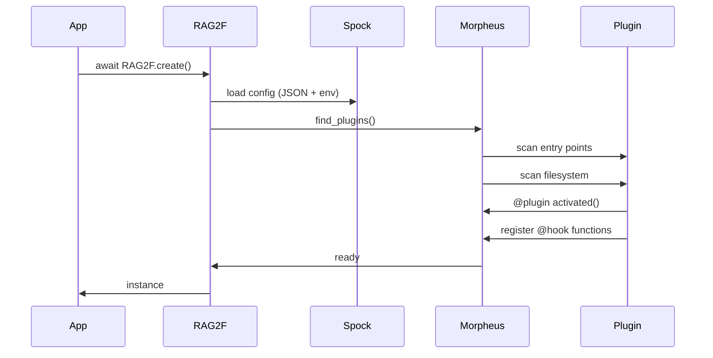
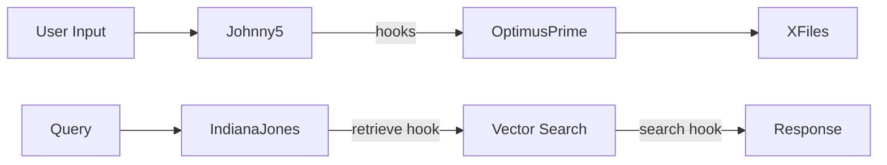

# Architecture

rag2f is a kernel: it gives you the smallest stable set of components needed to compose RAG systems.

Everything volatile lives outside the core — in plugins or your application.

## System Overview



> **Design Note:** The kernel stays small and stable. All volatile code (embedders, repositories, custom logic) lives in plugins, not core.

## High-level diagram

```text
               +-----------------------+
               |   Your Application    |
               +-----------+-----------+
                           |
                        RAG2F
                           |
        +------------------+------------------+
        |                  |                  |
      Spock             Morpheus          Johnny5
 (config manager)   (plugins & hooks)  (input manager)
        |                  |
        |            +-----+--------------------------+
        |            |                                |
   OptimusPrime    entry points                  filesystem
 (embedder registry) (rag2f.plugins)             ./plugins
        |
      XFiles
 (repository registry)
```

## What lives in core vs plugins

### Core (stable)
- configuration loader & merger (Spock)
- plugin discovery and hook orchestration (Morpheus)
- registries (OptimusPrime, XFiles)
- protocols/contracts and validation

### Plugins (volatile)
- embedders (Azure OpenAI, OpenAI, local models, etc.)
- repositories (Postgres, SQLite, Qdrant, Pinecone, Neo4j, etc.)
- orchestration patterns (pipelines, workers, DAGs)
- application-specific behavior via hooks

Plugins can ship their own dependencies so the kernel stays minimal and stable.

## Naming is intentional

The narrative names are constraints on design:

- registries/managers should stay small and predictable
- executors/orchestrators should live outside the kernel

This helps prevent a “god object” core.

## Pipeline philosophy

rag2f does not impose a single “retrieve → rerank → generate” pipeline.
Instead, you build pipelines by composing:
- hooks
- registries (get the embedder/repository you need)
- your own application code

## Startup sequence



A typical startup flow:

1. **Spock loads configuration** from JSON + env (env wins).
2. **Morpheus discovers plugins** (entry points, then filesystem).
3. **Plugins register hooks** and contribute embedders/repositories.
4. **Registries validate** implementations and enforce contracts.
5. Your app composes a pipeline with hooks and registry lookups.

## Data flow (conceptual)



Johnny5 accepts input, then Morpheus runs the hook pipeline. The pipeline uses
registries to fetch embedders or repositories as needed.

## Core vs Plugins

| Core (stable) | Plugins (volatile) |
|---------------|-------------------|
| Spock (config) | Embedders (Azure, OpenAI, local) |
| Morpheus (plugins/hooks) | Repositories (Qdrant, Postgres, etc.) |
| OptimusPrime (registry) | Custom pipelines |
| XFiles (registry) | App-specific hooks |
| Johnny5 (input) | |
| IndianaJones (retrieval) | |

## Extension points

Where you can extend rag2f safely:

- **Plugins**: add embedders and repositories without touching core.
- **Hooks**: compose multi-step pipelines (preprocess, retrieve, rerank, generate).
- **Native handles**: drop down to backend SDKs when needed.

## Dependency isolation

Core dependencies are intentionally minimal. Heavy SDKs live in plugins, which means:

- faster base installs,
- smaller attack surface,
- backend-specific upgrades that do not destabilize the kernel.

## Runtime boundaries

The core does not:

- enforce a specific prompt format,
- provide a fixed agent loop,
- assume a specific vector database or LLM provider.

This keeps the kernel stable and lets you build opinionated workflows in plugins or app code.
