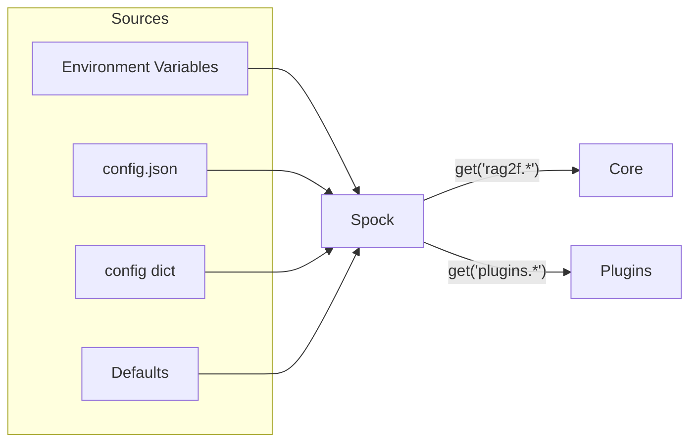

# Configuration (Spock)

Spock is the centralized configuration system for rag2f.



## Precedence

| Priority | Source | Use Case |
|----------|--------|----------|
| 1 (highest) | Environment | Secrets, per-env overrides |
| 2 | JSON file | Project settings |
| 3 | Config dict | Programmatic defaults |
| 4 | Defaults | Fallback values |

## Environment Variables

**Naming**: `RAG2F__<SECTION>__<KEY>__<SUBKEY>`

| Example | Overrides |
|---------|-----------|
| `RAG2F__RAG2F__EMBEDDER_DEFAULT=azure` | `rag2f.embedder_default` |
| `RAG2F__PLUGINS__MY_PLUGIN__API_KEY=xxx` | `plugins.my_plugin.api_key` |

**Type inference**: `true/false` → bool, numbers → int/float, JSON strings → parsed

## Config File

=== "Minimal"
    ```json
    {
      "rag2f": {
        "embedder_default": "test_embedder"
      }
    }
    ```

=== "With Plugin"
    ```json
    {
      "rag2f": {
        "embedder_default": "azure_openai_embedder"
      },
      "plugins": {
        "azure_openai_embedder": {
          "azure_endpoint": "https://your.openai.azure.com",
          "deployment": "text-embedding-ada-002"
        }
      }
    }
    ```

## Loading

```python
# From file
rag2f = await RAG2F.create(config_path="config.json")

# From dict
rag2f = await RAG2F.create(config={"rag2f": {"embedder_default": "test"}})
```

## Accessing Config

=== "Core Settings"
    ```python
    # Typed helper
    embedder = rag2f.spock.get_rag2f_config("embedder_default")
    
    # Direct path
    value = rag2f.spock.get("rag2f.embedder_default")
    ```

=== "Plugin Settings"
    ```python
    # Get entire plugin config
    cfg = rag2f.spock.get_plugin_config("azure_openai_embedder")
    api_key = cfg.get("api_key")
    
    # Direct path
    key = rag2f.spock.get("plugins.azure_openai_embedder.api_key")
    ```

## Best Practices

| Do | Don't |
|----|-------|
| Secrets in env vars | Secrets in config.json |
| Plugin config under `plugins.<id>` | Flat plugin config |
| Fail fast on missing required | Silent fallback |

## Troubleshooting

```python
rag2f.spock.is_loaded      # True if config loaded
rag2f.spock.config_path    # Path to loaded file
```
