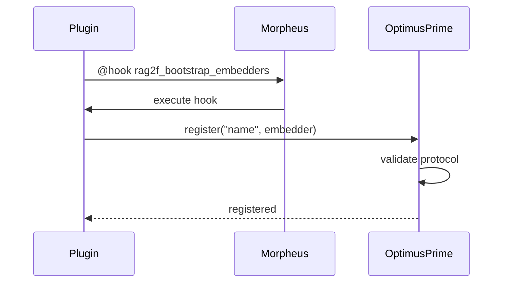

# Embedders (OptimusPrime)

OptimusPrime is the embedder registry. Embedders are contributed by plugins and must satisfy the `Embedder` protocol.

## Registration Flow



## The `Embedder` Protocol

```python
class Embedder(Protocol):
    @property
    def size(self) -> int:
        """Vector dimension (e.g., 1536)."""
        ...
    
    def getEmbedding(self, text: str, *, normalize: bool = False) -> list[float]:
        """Return embedding vector."""
        ...
```

## Quick Example

```python
# In your plugin hooks.py
@hook("rag2f_bootstrap_embedders", priority=10)
def register_embedder(*, rag2f):
    config = rag2f.spock.get_plugin_config("my_embedder")
    rag2f.optimus_prime.register("my_embedder", MyEmbedder(config))

# In your app
embedder = rag2f.optimus_prime.get_default()
vector = embedder.getEmbedding("hello world")
```

## API Reference

| Method | Description |
|--------|-------------|
| `register(key, embedder)` | Register embedder (validates protocol) |
| `get(key)` | Get by key (or `None`) |
| `get_default()` | Get default (config: `rag2f.embedder_default`) |
| `has(key)` | Check existence |
| `list_keys()` | List all registered |
| `unregister(key)` | Remove embedder |

## Override Policy

- Same instance + same key → OK (idempotent)
- Different instance + existing key → `ValueError`

## Default Selection

1. Single embedder → automatic default
2. Multiple → requires `rag2f.embedder_default` in config
3. No embedders → `LookupError`
