# Hooks Reference

Complete reference of all available hooks with signatures and examples.

## Available Hooks by Module

=== "🚀 Bootstrap"
    | Hook | Purpose |
    |------|---------|
    | [`rag2f_bootstrap_embedders`](#rag2f_bootstrap_embedders) | Register embedders/repos at startup |

=== "📥 Johnny5 (Input)"
    | Hook | Purpose |
    |------|---------|
    | [`get_id_input_text`](#get_id_input_text) | Generate ID for input |
    | [`check_duplicated_input_text`](#check_duplicated_input_text) | Check if duplicate |
    | [`handle_text_foreground`](#handle_text_foreground) | Process/store input |

=== "🔍 IndianaJones (Retrieval)"
    | Hook | Purpose |
    |------|---------|
    | [`indiana_jones_retrieve`](#indiana_jones_retrieve) | Vector retrieval |
    | [`indiana_jones_search`](#indiana_jones_search) | Search + synthesis |

## Hook Flow Overview

```mermaid
flowchart TB
    subgraph BOOTSTRAP["🚀 Bootstrap Phase"]
        B1[rag2f_bootstrap_embedders]
    end

    subgraph JOHNNY5["📥 Johnny5 - Input Processing"]
        J1[get_id_input_text]
        J2[check_duplicated_input_text]
        J3[handle_text_foreground]
        J1 --> J2 --> J3
    end

    subgraph INDIANA["🔍 IndianaJones - Retrieval"]
        I1[indiana_jones_retrieve]
        I2[indiana_jones_search]
    end

    BOOTSTRAP --> JOHNNY5
    JOHNNY5 --> INDIANA
```



> **Design Note:** Hooks follow a clear execution order. Bootstrap hooks run once at startup, Johnny5 hooks process each input, and IndianaJones hooks handle retrieval queries. Each hook can be overridden by registering a higher-priority implementation.

---

## Bootstrap Hooks

### `rag2f_bootstrap_embedders`

Called once during `RAG2F.create()` to register embedders and repositories.

| Property | Value |
|----------|-------|
| **Module** | OptimusPrime |
| **Piped** | No |
| **Signature** | `(*, rag2f)` |
| **Default Priority** | N/A (no default) |

```python
@hook("rag2f_bootstrap_embedders", priority=10)
def register_embedder(*, rag2f):
    """Register embedder during bootstrap."""
    config = rag2f.spock.get_plugin_config("my_plugin")
    
    # Validate config
    if not config.get("api_key"):
        raise ValueError("api_key required")
    
    embedder = MyEmbedder(api_key=config["api_key"])
    rag2f.optimus_prime.register("my_embedder", embedder)
    
    # Can also register repositories
    rag2f.xfiles.execute_register("my_repo", MyRepo())
```

---

## Johnny5 Hooks (Input Processing)

### `get_id_input_text`

Generate or retrieve a unique ID for incoming text.

| Property | Value |
|----------|-------|
| **Module** | Johnny5 |
| **Piped** | Yes (`track_id: str`) |
| **Signature** | `(track_id, text, *, rag2f)` |
| **Default** | UUID if no hook returns a value |

**Override example:**

```python
@hook("get_id_input_text", priority=10)
def custom_id(track_id, text, *, rag2f):
    """Generate custom ID based on content hash."""
    import hashlib
    return hashlib.sha256(text.encode()).hexdigest()[:16]
```

**Use default ID:**

```python
@hook("get_id_input_text", priority=5)
def maybe_custom_id(track_id, text, *, rag2f):
    """Only override for specific cases."""
    if text.startswith("SPECIAL:"):
        return f"special-{track_id}"
    return track_id  # Use existing/default ID
```

---

### `check_duplicated_input_text`

Check if input has already been processed.

| Property | Value |
|----------|-------|
| **Module** | Johnny5 |
| **Piped** | Yes (`is_dup: bool`) |
| **Signature** | `(is_dup, track_id, text, *, rag2f)` |
| **Default** | `False` (no duplicate check) |

```python
@hook("check_duplicated_input_text", priority=10)
def check_duplicate(is_dup, track_id, text, *, rag2f):
    """Check against stored IDs."""
    if is_dup:
        return is_dup  # Already flagged by higher-priority hook
    
    repo_result = rag2f.xfiles.execute_get("processed_ids")
    if repo_result.is_ok() and repo_result.repository:
        return repo_result.repository.exists(track_id)
    
    return False
```

---

### `handle_text_foreground`

Main input processing hook. This is where you store, embed, or index text.

| Property | Value |
|----------|-------|
| **Module** | Johnny5 |
| **Piped** | Yes (`done: bool`) |
| **Signature** | `(done, track_id, text, *, rag2f)` |
| **Default** | `NOT_HANDLED` if no hook returns `True` |

!!! warning "The `done` Pattern"
    Always check `done` first. If `True`, a higher-priority hook already processed this input.

**Basic implementation:**

```python
@hook("handle_text_foreground", priority=10)
def store_text(done, track_id, text, *, rag2f):
    """Store text in vector DB."""
    if done:
        return done  # Already handled
    
    # Get embedder and repository
    embedder = rag2f.optimus_prime.get_default()
    repo_result = rag2f.xfiles.execute_get("vectors")
    
    if not repo_result.is_ok() or not repo_result.repository:
        return False  # Let other hooks try
    
    # Embed and store
    vector = embedder.getEmbedding(text)
    repo_result.repository.insert(track_id, vector, {"text": text})
    
    return True  # Mark as handled
```

**Override default processing:**

```python
@hook("handle_text_foreground", priority=100)
def my_custom_processor(done, track_id, text, *, rag2f):
    """Override default - runs FIRST due to priority 100."""
    if done:
        return done
    
    # Your completely custom processing
    custom_pipeline(track_id, text)
    
    return True  # Prevents default hook from running
```

**Conditional processing:**

```python
@hook("handle_text_foreground", priority=50)
def selective_processor(done, track_id, text, *, rag2f):
    """Only process certain inputs."""
    if done:
        return done
    
    # Only handle specific inputs
    if not text.startswith("PROCESS:"):
        return False  # Let other hooks handle
    
    process_special(track_id, text)
    return True
```

---

## IndianaJones Hooks (Retrieval)

### `indiana_jones_retrieve`

Transform or implement retrieval logic.

| Property | Value |
|----------|-------|
| **Module** | IndianaJones |
| **Piped** | Yes (`result: RetrieveResult`) |
| **Signature** | `(result, query, k, *, rag2f)` |
| **Default** | Empty result if no hook implements |

```python
from rag2f.core.dto.indiana_jones_dto import RetrieveResult, RetrievedItem

@hook("indiana_jones_retrieve", priority=10)
def vector_retrieval(result, query, k, *, rag2f):
    """Implement vector search retrieval."""
    embedder = rag2f.optimus_prime.get_default()
    repo_result = rag2f.xfiles.execute_get("vectors")
    
    if not repo_result.is_ok():
        return result  # Pass through
    
    # Embed query and search
    query_vec = embedder.getEmbedding(query)
    results = repo_result.repository.vector_search(query_vec, k)
    
    items = [
        RetrievedItem(
            id=r["id"],
            text=r.get("text", ""),
            score=r.get("score"),
            metadata=r.get("metadata", {})
        )
        for r in results
    ]
    
    return RetrieveResult.success(query=query, items=items)
```

**Override retrieval:**

```python
@hook("indiana_jones_retrieve", priority=100)
def my_retrieval(result, query, k, *, rag2f):
    """Override default retrieval completely."""
    # Your custom retrieval logic
    items = my_custom_search(query, k)
    return RetrieveResult.success(query=query, items=items)
```

---

### `indiana_jones_search`

Transform or implement search (retrieve + synthesize) logic.

| Property | Value |
|----------|-------|
| **Module** | IndianaJones |
| **Piped** | Yes (`result: SearchResult`) |
| **Signature** | `(result, query, k, return_mode, kwargs, *, rag2f)` |
| **Default** | Empty result if no hook implements |

```python
from rag2f.core.dto.indiana_jones_dto import SearchResult, ReturnMode

@hook("indiana_jones_search", priority=10)
def rag_search(result, query, k, return_mode, kwargs, *, rag2f):
    """Implement RAG search with LLM synthesis."""
    # 1. Retrieve relevant chunks
    retrieve_result = rag2f.indiana_jones.execute_retrieve(query, k)
    
    if not retrieve_result.is_ok():
        return result
    
    # 2. Build context from chunks
    context = "\n\n".join([
        f"[{item.id}]: {item.text}" 
        for item in retrieve_result.items
    ])
    
    # 3. Generate response (your LLM call)
    response = generate_with_llm(
        f"Based on:\n{context}\n\nAnswer: {query}"
    )
    
    # 4. Return result
    return SearchResult.success(
        query=query,
        response=response,
        used_source_ids=[item.id for item in retrieve_result.items],
        items=retrieve_result.items if return_mode == ReturnMode.WITH_ITEMS else None
    )
```

---

## Hook Execution Order


## Override Summary

| To Override | Hook | Your Priority | Pattern |
|-------------|------|---------------|---------|
| ID generation | `get_id_input_text` | > default | Return new ID |
| Duplicate check | `check_duplicated_input_text` | > default | Return `True`/`False` |
| Input processing | `handle_text_foreground` | > 1 | Check `done`, return `True` |
| Retrieval | `indiana_jones_retrieve` | > existing | Return `RetrieveResult` |
| Search/RAG | `indiana_jones_search` | > existing | Return `SearchResult` |
| Embedder registration | `rag2f_bootstrap_embedders` | Any | Side-effect only |

### Override Examples

=== "Replace Default ID Generator"
    ```python
    @hook("get_id_input_text", priority=100)
    def hash_based_id(track_id, text, *, rag2f):
        """Use content hash instead of UUID."""
        import hashlib
        return hashlib.sha256(text.encode()).hexdigest()[:16]
    ```

=== "Block Duplicate Processing"
    ```python
    @hook("handle_text_foreground", priority=100)
    def block_duplicates(done, track_id, text, *, rag2f):
        """Stop processing if text matches pattern."""
        if done:
            return done
        if text.startswith("SKIP:"):
            return True  # Mark as done, skip all processing
        return False  # Let other hooks handle
    ```

=== "Custom Retrieval Backend"
    ```python
    @hook("indiana_jones_retrieve", priority=100)
    def elasticsearch_retrieval(result, query, k, *, rag2f):
        """Use Elasticsearch instead of vector DB."""
        from elasticsearch import Elasticsearch
        es = Elasticsearch()
        
        hits = es.search(index="docs", q=query, size=k)["hits"]["hits"]
        items = [
            RetrievedItem(id=h["_id"], text=h["_source"]["text"], score=h["_score"])
            for h in hits
        ]
        return RetrieveResult.success(query=query, items=items)
    ```

!!! tip "Finding Current Priorities"
    ```python
    for name, hooks in rag2f.morpheus.hooks.items():
        print(f"{name}:")
        for h in hooks:
            print(f"  {h.plugin_id}: priority={h.priority}")
    ```
