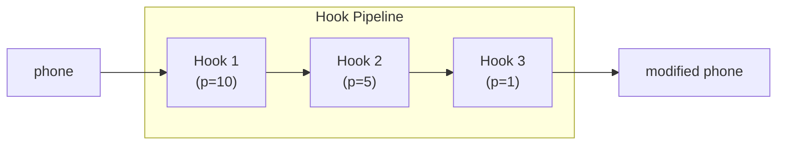
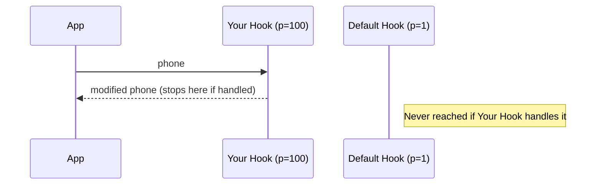

# Hooks

Hooks are rag2f's main extension point — they let plugins modify behavior without changing the core.

## How Hooks Work



> **Design Note:** The pipeline pattern with `phone` enables functional composition: each hook transforms the input and passes it to the next. Priority ordering ensures that high-priority overrides can block or transform before standard plugins.

The first positional argument (`phone`) flows through all hooks in **priority order** (higher first).

## Overriding Default Behavior

!!! tip "The Override Pattern"
    To override a default behavior, register a hook with **higher priority** than the default.



> **Design Note:** The override pattern with priority exists to allow plugins to "take control" of a hook, preventing subsequent hooks (at lower priority) from performing redundant or conflicting processing. This is critical for testing and special cases.

### Example: Override Default Processing

```python
# Default plugin (priority=1) handles text normally
@hook("handle_text_foreground", priority=1)
def default_handler(done, track_id, text, *, rag2f):
    if done:
        return done
    # Default processing...
    return True

# YOUR plugin (priority=100) overrides it
@hook("handle_text_foreground", priority=100)
def my_override(done, track_id, text, *, rag2f):
    """Override default - runs FIRST due to higher priority."""
    if done:
        return done
    
    # Your custom processing instead
    custom_process(track_id, text)
    return True  # Mark as done, default never runs
```

### The `done` Pattern

For processing hooks like `handle_text_foreground`, use the `done` flag:

```python
@hook("handle_text_foreground", priority=50)
def my_handler(done, track_id, text, *, rag2f):
    # Check if already handled by higher-priority hook
    if done:
        return done  # Pass through, don't re-process
    
    # Your processing logic
    success = process(track_id, text)
    return success  # True = handled, False = let others try
```

## Hook Types

=== "Pipeable (transform data)"
    ```python
    @hook("preprocess", priority=5)
    def clean(phone, *, rag2f):
        phone["text"] = phone["text"].strip()
        return phone  # Required! Returns to next hook
    ```

=== "Side-effect (no piping)"
    ```python
    @hook("rag2f_bootstrap_embedders", priority=10)
    def setup(*, rag2f):
        rag2f.optimus_prime.register("my_emb", MyEmbedder())
        # No return needed
    ```

=== "Processing (done pattern)"
    ```python
    @hook("handle_text_foreground", priority=10)
    def process(done, track_id, text, *, rag2f):
        if done:
            return done
        # Process...
        return True  # Mark as handled
    ```

## Priority Guidelines

| Priority | Use Case | Example |
|----------|----------|---------|
| `100+` | Override everything | Testing, special cases |
| `50-99` | Custom primary impl | Your main processing |
| `10-49` | Standard plugins | Normal plugins |
| `1-9` | Fallback/default | Core defaults |

!!! warning "Higher = First"
    Priority `100` runs **before** priority `1`.

## Defining Hooks

```python
from rag2f.core.morpheus.decorators import hook

# Explicit name
@hook("my_hook", priority=10)
def handler(phone, *, rag2f):
    return phone

# Function name as hook name
@hook(priority=5)
def my_hook(phone, *, rag2f):
    return phone

# Default priority (1)
@hook
def my_hook(phone, *, rag2f):
    return phone
```

## Executing Hooks

```python
# From your application
phone = {"text": "hello"}
phone = rag2f.morpheus.execute_hook("preprocess", phone, rag2f=rag2f)
```

If no hooks registered → returns input unchanged.

## Return Value Rules

| Return | Effect |
|--------|--------|
| Value | Passed to next hook |
| `None` | Previous value continues |
| `True/False` | For done-pattern hooks |

## Built-in Hooks

=== "🚀 Bootstrap"
    | Hook | Signature | Purpose |
    |------|-----------|---------|
    | `rag2f_bootstrap_embedders` | `(*, rag2f)` | Register embedders/repos at startup |

=== "📥 Johnny5 (Input)"
    | Hook | Signature | Purpose |
    |------|-----------|---------|
    | `get_id_input_text` | `(track_id, text, *, rag2f)` | Generate/retrieve input ID |
    | `check_duplicated_input_text` | `(is_dup, track_id, text, *, rag2f)` | Check duplicate input |
    | `handle_text_foreground` | `(done, track_id, text, *, rag2f)` | Process/store/embed input |

=== "🔍 IndianaJones (Retrieval)"
    | Hook | Signature | Purpose |
    |------|-----------|---------|
    | `indiana_jones_retrieve` | `(result, query, k, *, rag2f)` | Vector retrieval |
    | `indiana_jones_search` | `(result, query, k, mode, kwargs, *, rag2f)` | Search + LLM synthesis |

See [Hooks Reference](hooks-reference.md) for complete documentation with examples.

## Custom Hooks

Define your own hooks for custom pipelines:

```python
# Plugin A defines the hook
@hook("my_custom_pipeline", priority=10)
def step_one(phone, *, rag2f):
    phone["step1"] = True
    return phone

# Plugin B extends it
@hook("my_custom_pipeline", priority=5)
def step_two(phone, *, rag2f):
    phone["step2"] = True
    return phone

# Execute in your app
phone = rag2f.morpheus.execute_hook("my_custom_pipeline", {}, rag2f=rag2f)
# phone = {"step1": True, "step2": True}
```

## Testing Hooks

Hooks are plain functions — test directly:

```python
from unittest.mock import MagicMock

def test_my_hook():
    phone = {"text": "  hello  "}
    result = clean(phone, rag2f=MagicMock())
    assert result["text"] == "hello"
```
