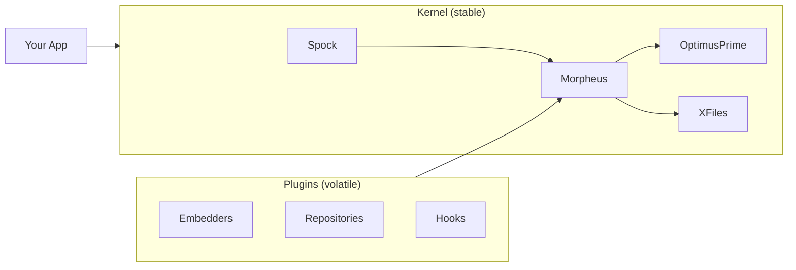

# rag2f overview

**rag2f** (short for "rag to the future") is a *plugin-first, entry-point–driven kernel* for composing Retrieval-Augmented Generation (RAG) systems **without forcing a single pipeline shape**.

> rag2f is **not** a turnkey RAG pipeline.  
> Pipelines live in plugins or in *your* application.

## The problem it solves

RAG stacks depend on fast-moving infrastructure (vector DBs, LLM SDKs, hosted services). That creates two recurring problems:

- **Supply-chain risk**: dependency churn breaks builds, increases attack surface, and forces migrations.
- **Architecture rigidity**: “one pipeline to rule them all” hides backend-specific power and makes swaps painful.

rag2f addresses both by:
- keeping the **base install lean**,
- pushing integrations into **plugins** with scoped dependencies,
- using **explicit contracts** (protocols) and **capability declarations**.

## Why rag2f

The kernel stays intentionally small so you can evolve your stack safely. In practice, this means:

- plugins own their dependencies instead of ballooning the core,
- registries give you a stable surface area for embedders and repositories,
- hooks let plugins compose behavior without a forced pipeline shape.

## Design goals

- **Small, stable core**: registries + hooks only, no opinionated pipeline.
- **Volatile edges**: backends and SDKs live in plugins, not the kernel.
- **Explicit contracts**: protocols and capabilities make features clear.
- **Instance isolation**: each RAG2F instance has its own config and registries.
- **Deterministic discovery**: entry-point plugins override filesystem plugins.

## When rag2f is a good fit

Use rag2f when you need:
- multiple storage backends or embedding providers,
- a pluggable architecture with strict boundaries,
- a core you can keep stable while integrations evolve.

rag2f may not be a fit when you want a single, fixed pipeline with all decisions pre-made.

## What you get in core

A `RAG2F` instance wires together a few intentionally-named components:

- **Spock**: configuration manager (JSON + env; env overrides JSON)
- **Morpheus**: plugin & hook manager (entry points + filesystem)
- **OptimusPrime**: embedder registry (embedders contributed by plugins)
- **XFiles**: repository registry (SQL/vector/graph/document repositories)
- **Johnny5**: input manager (small deterministic pre-processing)

## Registries + hooks (mental model)

rag2f is easiest to reason about as **registries + hooks**:

- **Registries** store validated implementations (embedders, repositories).
- **Hooks** let plugins contribute those implementations (and compose behavior).
- The core stays stable while plugins evolve independently.

## Plugin discovery model

Plugins are discovered in two places (in precedence order):

1. **Entry points** (`rag2f.plugins`) for installed packages
2. **Filesystem plugins** (local development in `./plugins`)

Entry points win over filesystem to avoid ambiguity in production.

## The typical lifecycle

1. **Load configuration** (Spock) and validate basics.
2. **Discover plugins** (Morpheus) from entry points and local folders.
3. **Register capabilities** (embedders, repositories, hooks).
4. **Compose a pipeline** in your app or via plugin hooks.
5. **Execute** RAG workflows using the registries and hooks.

This keeps the kernel stable while allowing your stack to evolve.

## How to extend safely

- Add embedders and repositories via plugins.
- Keep plugin dependencies scoped to the plugin folder.
- Use hooks for behavior composition; keep core untouched.

## Quick links

| Getting Started | Core Concepts | Reference |
|-----------------|---------------|-----------|
| [Quickstart](quickstart.md) | [Concepts](concepts.md) | [Hooks Reference](hooks-reference.md) |
| [Installation](installation.md) | [Architecture](architecture.md) | [Result Pattern](result-pattern.md) |
| [Configuration](configuration.md) | [Plugins](plugins.md) | [Troubleshooting](troubleshooting.md) |
| | [Hooks](hooks.md) | |
| | [Embedders](embedders.md) | |
| | [Repositories](repositories.md) | |

## License

rag2f is distributed under **GPL-3.0** (see the repository’s `LICENSE`).

## Get in touch

If you’re working on rag2f plugins or want to align on architecture, open a GitHub issue/discussion in the rag2f repo.
