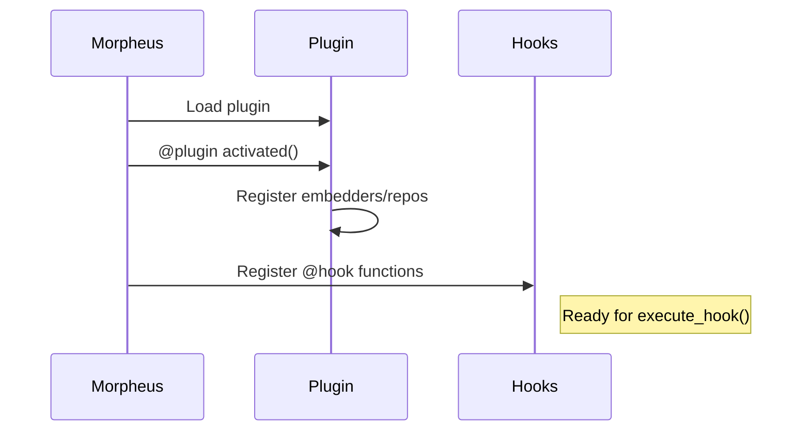

# Plugin Anatomy

Detailed structure, lifecycle, and best practices for rag2f plugins.

## Plugin Structure

=== "Minimal"
    ```
    my_plugin/
    ├── plugin.toml      # Metadata (required)
    └── hooks.py         # Hook implementations
    ```

=== "Recommended"
    ```
    my_plugin/
    ├── plugin.toml          # Metadata
    ├── __init__.py          # Package init
    ├── hooks.py             # Hook implementations
    ├── requirements.txt     # Plugin dependencies
    ├── README.md            # Documentation
    └── tests/
        └── test_hooks.py
    ```

## Plugin Manifest

=== "plugin.toml (preferred)"
    ```toml
    [plugin]
    id = "my_plugin"
    name = "My Plugin"
    version = "1.0.0"
    description = "What this plugin does"
    
    # Optional
    author_name = "Your Name"
    license = "MIT"
    min_rag2f_version = "0.1.0"
    ```

=== "plugin.json"
    ```json
    {
      "id": "my_plugin",
      "name": "My Plugin",
      "version": "1.0.0",
      "module": "hooks.py"
    }
    ```

## Lifecycle Decorators

### The `@plugin` Decorator

Use `@plugin` for lifecycle hooks that run during plugin activation/deactivation.

```python
from rag2f.core.morpheus.decorators import plugin

@plugin
def activated(plugin, rag2f):
    """Called when plugin is loaded.
    
    Args:
        plugin: Plugin object with id, path, etc.
        rag2f: RAG2F instance
    """
    config = rag2f.spock.get_plugin_config(plugin.id)
    
    # Register resources
    rag2f.optimus_prime.register("my_emb", MyEmbedder(config))
    rag2f.xfiles.execute_register("my_repo", MyRepo())

@plugin
def deactivated(plugin, rag2f):
    """Called when plugin is unloaded (optional)."""
    # Cleanup resources if needed
    pass
```

!!! warning "Function Name Matters"
    The function must be named `activated` or `deactivated` exactly.

### `@plugin` vs `@hook`

| Decorator | Purpose | When Called |
|-----------|---------|-------------|
| `@plugin` | Lifecycle (setup/teardown) | Plugin load/unload |
| `@hook` | Pipeline extension | During `execute_hook()` |



> **Design Note:** The separation of `@plugin` (lifecycle) vs `@hook` (runtime) allows heavy setup (DB connections, API clients) in `activated()` that happens once, while `@hook` functions remain pure and fast, called repeatedly during execution.

## The `@hook` Decorator

Register functions to participate in named pipelines.

```python
from rag2f.core.morpheus.decorators import hook

# Explicit name and priority
@hook("preprocess", priority=10)
def my_preprocess(phone, *, rag2f):
    return phone

# Use function name as hook name
@hook(priority=5)
def preprocess(phone, *, rag2f):
    return phone

# Default priority (1)
@hook
def preprocess(phone, *, rag2f):
    return phone
```

## Complete Plugin Example

```python title="hooks.py"
"""Azure OpenAI Embedder Plugin."""

from rag2f.core.morpheus.decorators import hook, plugin


class AzureEmbedder:
    """Azure OpenAI embedder implementation."""
    
    def __init__(self, endpoint: str, api_key: str, deployment: str):
        from openai import AzureOpenAI
        self._client = AzureOpenAI(
            azure_endpoint=endpoint,
            api_key=api_key,
            api_version="2024-02-01"
        )
        self._deployment = deployment
    
    @property
    def size(self) -> int:
        return 1536
    
    def getEmbedding(self, text: str, normalize: bool = False):
        response = self._client.embeddings.create(
            model=self._deployment,
            input=text
        )
        return response.data[0].embedding


# ============ LIFECYCLE ============

@plugin
def activated(plugin, rag2f):
    """Register embedder on plugin activation."""
    config = rag2f.spock.get_plugin_config(plugin.id)
    
    # Validate required config
    required = ["endpoint", "deployment"]
    missing = [k for k in required if not config.get(k)]
    if missing:
        raise ValueError(f"{plugin.id}: Missing config: {missing}")
    
    # API key from ENV
    api_key = config.get("api_key")
    if not api_key:
        raise ValueError(
            f"{plugin.id}: api_key required. "
            f"Set RAG2F__PLUGINS__{plugin.id.upper()}__API_KEY"
        )
    
    # Create and register embedder
    embedder = AzureEmbedder(
        endpoint=config["endpoint"],
        api_key=api_key,
        deployment=config["deployment"]
    )
    
    rag2f.optimus_prime.register("azure_openai", embedder)


# ============ HOOKS ============

@hook("handle_text_foreground", priority=10)
def embed_and_store(done, track_id, text, *, rag2f):
    """Store text embeddings in vector DB."""
    if done:
        return done
    
    embedder = rag2f.optimus_prime.get("azure_openai")
    repo_result = rag2f.xfiles.execute_get("vectors")
    
    if not embedder or not repo_result.is_ok():
        return False  # Let other hooks handle
    
    vector = embedder.getEmbedding(text)
    repo_result.repository.insert(track_id, vector, {"text": text})
    
    return True
```

```toml title="plugin.toml"
[plugin]
id = "azure_openai_embedder"
name = "Azure OpenAI Embedder"
version = "1.0.0"
description = "Embedder using Azure OpenAI"
min_rag2f_version = "0.1.0"
```

```txt title="requirements.txt"
openai>=1.0.0
```

## Plugin Dependencies

```txt title="requirements.txt"
openai>=1.0.0
qdrant-client>=1.7.0
```

!!! tip "Lazy Imports"
    Import heavy dependencies inside functions to speed up startup:
    ```python
    @plugin
    def activated(plugin, rag2f):
        from openai import AzureOpenAI  # Import here, not at top
        ...
    ```

## Publishing to PyPI

```toml title="pyproject.toml"
[project]
name = "rag2f-azure-openai"
version = "1.0.0"
dependencies = ["rag2f>=0.1.0", "openai>=1.0.0"]

[project.entry-points."rag2f.plugins"]
azure_openai_embedder = "rag2f_azure_openai:get_plugin_path"
```

```python title="__init__.py"
from pathlib import Path

def get_plugin_path() -> str:
    return str(Path(__file__).parent)
```

## Testing Plugins

```python title="tests/test_plugin.py"
import pytest
from unittest.mock import MagicMock

def test_activated_validates_config():
    """Test that activation fails without required config."""
    from hooks import activated
    
    mock_plugin = MagicMock()
    mock_plugin.id = "azure_openai_embedder"
    
    mock_rag2f = MagicMock()
    mock_rag2f.spock.get_plugin_config.return_value = {}
    
    with pytest.raises(ValueError, match="Missing config"):
        activated(mock_plugin, mock_rag2f)

def test_hook_handles_missing_embedder():
    """Test hook gracefully handles missing embedder."""
    from hooks import embed_and_store
    
    mock_rag2f = MagicMock()
    mock_rag2f.optimus_prime.get.return_value = None
    
    result = embed_and_store(False, "id", "text", rag2f=mock_rag2f)
    assert result == False  # Let other hooks handle
```
