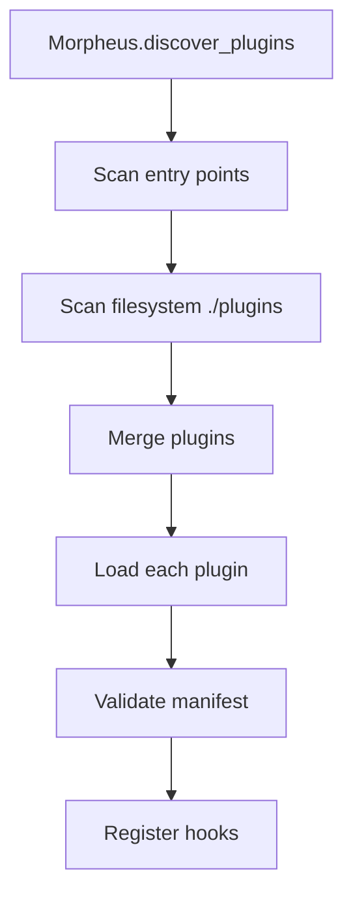

# Plugins & hooks (Morpheus)

Morpheus is the plugin manager. It discovers plugins, loads them, and executes hook pipelines.

> "You take the red pill, you stay in Wonderland."
> - Morpheus, The Matrix

```
  ____
 / __ \  Morpheus
 \_\_\_\  pill
```

## Discovery model



> **Design Note:** The entry points → filesystem order ensures that installed plugins (production) win over local versions (dev), avoiding ambiguity in deployments. This makes discovery deterministic and predictable.

rag2f discovers plugins in two places (in this precedence order):

1. **Python entry points** (installed packages)
2. **Filesystem plugins folder** (local development)

Entry points win over filesystem to prevent ambiguity (an installed plugin overrides a local plugin with the same id).

### Entry points

Plugins can be published as Python packages and expose an entry point in the group:

- `rag2f.plugins`

The entry point must be **callable** and must return a **string path** to the plugin directory.

Conceptual `pyproject.toml` snippet (in the *plugin* package):

```toml
[project.entry-points."rag2f.plugins"]
rag2f-azure-openai-embedder = "rag2f_azure_openai_embedder:get_plugin_path"
```

Where `get_plugin_path()` returns the on-disk folder that contains your `plugin.json` and plugin code.

### Filesystem plugins

For local development, Morpheus loads plugins from:

- `plugins_folder` passed to `RAG2F.create(...)`, or
- default `./plugins`

## Plugin metadata

A plugin can define metadata via:
- `plugin.json` (preferred)
- `pyproject.toml` (can override/augment)
- `requirements.txt` (optional; for plugin-scoped deps)

rag2f merges metadata with a precedence model so you can ship packaged plugins and still support local dev.

### Manifest merge and defaults

- Root-level `plugin.json` wins over nested manifests.
- `pyproject.toml` can augment fields like name, description, and URLs.
- If no name is provided, rag2f derives a humanized name from the plugin id.

### Plugin ID and config namespace

The plugin `id` is the stable identifier used for:

- config namespace: `plugins.<plugin_id>`
- hook ownership and logging
- avoiding collisions between plugins

Use a short, lowercase id (e.g. `azure_openai_embedder`).

### Minimal `plugin.json`

```json
{
  "id": "hello_plugin",
  "name": "Hello Plugin",
  "version": "0.1.0",
  "module": "hello_plugin.py"
}
```

Common optional fields:

- `description`, `license`, `keywords`
- `author_name`, `author_email`
- `urls` (project/home/docs)
- `min_rag2f_version`, `max_rag2f_version`

### Suggested folder layout

```
plugins/
  hello_plugin/
    plugin.json
    hello_plugin.py
    README.md
```

If your plugin is packaged, the entry point should return the folder that contains `plugin.json`.

## Plugin-scoped dependencies

Plugins can ship their own dependencies via a local `requirements.txt`. Morpheus installs those requirements on activation so the core stays lean and plugins stay isolated.

### Dependency guidelines

- Keep heavy SDKs in plugins, not core.
- Avoid importing optional dependencies at module import time.
- Validate config before initializing expensive clients.

## Writing hooks

A hook is a Python function decorated with `@hook`.

```python
from rag2f.core.morpheus.decorators.hook import hook

@hook("search", priority=10)
def my_search_hook(phone, *, rag2f):
    # phone is the “pipe” value that flows through hooks
    phone["results"].append("hello")
    return phone
```

### Hook piping model

If a hook takes at least one argument, Morpheus will **pipe** the first argument (`phone`) through all registered hook functions in priority order.

If a hook takes **no arguments** (besides `rag2f`), it runs for side effects.

See [Hooks](hooks.md) for details.

## Plugin activation patterns

Common plugin patterns:

- **Register resources**: add embedders or repositories during plugin initialization.
- **Expose hooks**: define `@hook` functions to compose behavior.
- **Validate config**: fail fast if required config is missing.

Keep plugin modules focused; avoid importing heavy dependencies at import time if they are optional.

## Lifecycle overrides

Use the `@plugin` decorator for lifecycle overrides (activation/deactivation) when you need to run setup or cleanup logic tied to the plugin itself.

## Entry point troubleshooting

If an entry point returns the wrong path (e.g. `site-packages/`), the plugin will not load.
Ensure your `get_plugin_path()` returns the folder containing `plugin.json`.

## Refreshing plugins

Morpheus supports cache refresh and will notify other components via callbacks when a refresh happens.
This is useful in dev workflows when you are iterating on local plugins.
