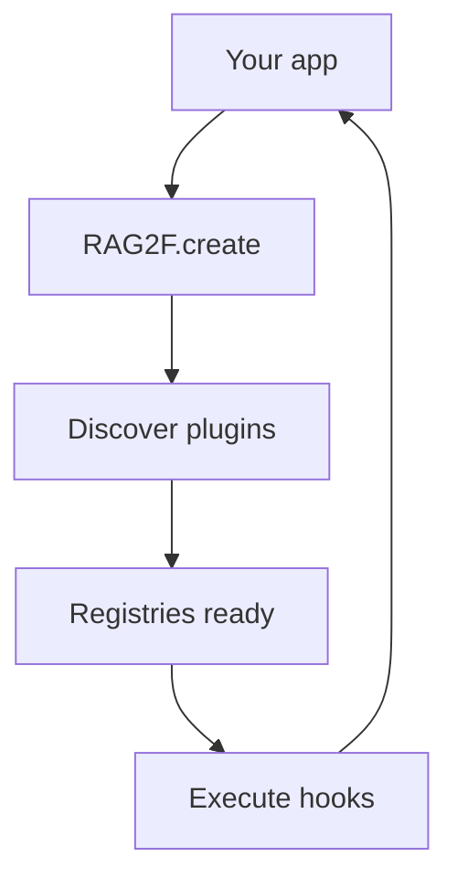

# Quickstart

This page shows the smallest “hello world” you can run with rag2f.

## 1) Install

```bash
# Recommended: Dev Container (VS Code / devcontainers CLI)
# - Open the repo in the dev container and wait for the container to build
pip install -e .
```

(If you prefer a local venv instead of a dev container: `python -m venv .venv && source .venv/bin/activate`.)

## 2) Create a config (optional)

rag2f can run with an empty config, but most real usage needs at least an embedder and one repository.

Create `config.json`:

```json
{
  "rag2f": {
    "embedder_default": "my_embedder"
  },
  "plugins": {
    "my_embedder_plugin": {
      "api_key": "..."
    }
  }
}
```

## 3) Add a tiny local plugin (optional)

Local plugins are the fastest way to test hooks and registries.

Create a plugin folder:

```
plugins/
  hello_plugin/
    plugin.json
    hello_plugin.py
```

Example `plugin.json`:

```json
{
  "id": "hello_plugin",
  "name": "Hello Plugin",
  "version": "0.1.0",
  "module": "hello_plugin.py"
}
```

Example `hello_plugin.py`:

```python
from rag2f.core.morpheus.decorators.hook import hook

@hook("preprocess", priority=5)
def add_tag(phone, *, rag2f):
    phone["tags"] = phone.get("tags", []) + ["hello"]
    return phone
```

## 4) Start an instance and discover plugins



> **Design Note:** The create → discover → register → execute cycle keeps clean separation between setup (async) and runtime (sync), allowing early validation and fail-fast if configuration or plugins have issues.

```python
import asyncio
from rag2f.core.rag2f import RAG2F

async def main():
    rag2f = await RAG2F.create(
        plugins_folder="plugins/",    # optional; defaults to ./plugins
        config_path="config.json",    # optional
    )

    # Embedder
    embedder = rag2f.optimus_prime.get_default()
    v = embedder.getEmbedding("hello rag2f")

    print(len(v), v[:5])

asyncio.run(main())
```

## 5) Compose a minimal pipeline

rag2f does not impose a pipeline; you compose one with hooks and registries:

```python
phone = {"text": "hello rag2f"}
phone = rag2f.morpheus.execute_hook("preprocess", phone, rag2f=rag2f)
phone = rag2f.morpheus.execute_hook("retrieve", phone, rag2f=rag2f)
phone = rag2f.morpheus.execute_hook("rerank", phone, rag2f=rag2f)
phone = rag2f.morpheus.execute_hook("generate", phone, rag2f=rag2f)
```

Hooks are optional. If no plugin implements a hook, the phone passes through unchanged.

## 6) Use repositories (XFiles)

Once a repository plugin is registered, you can fetch it by name/id and call protocol methods based on capabilities.

Conceptually:

```python
repo_result = rag2f.xfiles.execute_get("primary")
if not repo_result.is_ok() or not repo_result.repository:
    raise LookupError("Repository 'primary' not found")
repo = repo_result.repository

# Minimal CRUD
await repo.insert({"id": "1", "text": "hello"})

# Optional query / vector search if supported by the repository
rows = await repo.find({"where": {"field": "text", "op": "contains", "value": "hello"}})
```

See [Repositories (XFiles)](repositories.md) for the real contracts and `QuerySpec` shapes.

## Example walkthrough: tiny in-memory "notes RAG"

This walkthrough is fully local (no external APIs) and touches the main pieces: plugins, embedders, repositories, and a hook-based retrieval step. You can run it end-to-end to verify the repo works on your machine.

### 1) Create a local demo plugin

```
plugins/
  tiny_demo/
    plugin.json
    tiny_demo.py
```

`plugins/tiny_demo/plugin.json`:

```json
{
  "id": "tiny_demo",
  "name": "Tiny Demo Plugin",
  "version": "0.1.0",
  "module": "tiny_demo.py"
}
```

`plugins/tiny_demo/tiny_demo.py`:

```python
from rag2f.core.morpheus.decorators import hook, plugin
from rag2f.core.xfiles import BaseRepository, minimal_crud_capabilities


class InMemoryRepo(BaseRepository):
    def __init__(self, name="tiny_repo"):
        self._name = name
        self._rows = {}

    @property
    def name(self) -> str:
        return self._name

    def capabilities(self):
        return minimal_crud_capabilities()

    def get(self, id, select=None):
        return self._rows[id]

    def insert(self, id, item):
        self._rows[id] = item

    def update(self, id, patch):
        self._rows[id] = {**self._rows[id], **patch}

    def delete(self, id):
        self._rows.pop(id, None)

    def all(self):
        return list(self._rows.values())

    def _get_native_handle(self, kind: str):
        raise NotImplementedError("Native handles not supported in this demo")


class TinyEmbedder:
    """Toy embedder for the demo: keyword presence vector."""

    _keys = ("password", "refund", "hours")

    @property
    def size(self) -> int:
        return len(self._keys)

    def getEmbedding(self, text: str, *, normalize: bool = False):
        text = text.lower()
        vec = [1.0 if key in text else 0.0 for key in self._keys]
        if normalize:
            norm = (sum(v * v for v in vec) ** 0.5) or 1.0
            vec = [v / norm for v in vec]
        return vec


@plugin
def activated(plugin, rag2f):
    """Lifecycle hook: register the demo embedder + repo."""
    if not rag2f.optimus_prime.has("tiny_embedder"):
        rag2f.optimus_prime.register("tiny_embedder", TinyEmbedder())

    if not rag2f.xfiles.has("tiny_repo"):
        result = rag2f.xfiles.execute_register(
            "tiny_repo",
            InMemoryRepo(),
            meta={"type": "memory", "domain": "demo"},
        )
        if result.is_error():
            raise RuntimeError(result.detail.message)


@hook("retrieve", priority=10)
def retrieve(phone, *, rag2f):
    """Naive retrieval: cosine over keyword vectors."""
    repo_result = rag2f.xfiles.execute_get("tiny_repo")
    repo = repo_result.repository if repo_result.is_ok() else None
    embedder = rag2f.optimus_prime.get("tiny_embedder")
    if repo is None or embedder is None:
        return phone

    query_vec = embedder.getEmbedding(phone["query"], normalize=True)
    results = []
    for row in repo.all():
        score = sum(a * b for a, b in zip(query_vec, row["embedding"], strict=False))
        results.append({"id": row["id"], "text": row["text"], "score": score})

    results.sort(key=lambda r: r["score"], reverse=True)
    phone["results"] = results[: phone.get("top_k", 3)]
    return phone
```

Note: the lifecycle function must be named `activated` to run on plugin load.

### 2) Create a runnable script

`examples/tiny_demo.py`:

```python
import asyncio
from rag2f.core.rag2f import RAG2F


async def main():
    rag2f = await RAG2F.create(plugins_folder="plugins/")

    repo_result = rag2f.xfiles.execute_get("tiny_repo")
    repo = repo_result.repository if repo_result.is_ok() else None
    embedder = rag2f.optimus_prime.get("tiny_embedder")
    if repo is None or embedder is None:
        raise RuntimeError("Demo plugin did not load")

    docs = {
        "pwd_reset": "Reset your password in the account settings.",
        "refund_policy": "Refunds are available within 30 days.",
        "support_hours": "Support hours are Mon-Fri 9-5.",
    }

    for doc_id, text in docs.items():
        repo.insert(
            doc_id,
            {
                "id": doc_id,
                "text": text,
                "embedding": embedder.getEmbedding(text, normalize=True),
            },
        )

    phone = {"query": "I forgot my password", "top_k": 2}
    phone = rag2f.morpheus.execute_hook("retrieve", phone, rag2f=rag2f)

    for hit in phone["results"]:
        print(f"{hit['id']} (score={hit['score']:.2f}): {hit['text']}")


asyncio.run(main())
```

### 3) Run it

```bash
python examples/tiny_demo.py
```

Expected: `pwd_reset` should be the top hit (score ~1.00).

## 7) Add a simple repository plugin (sketch)

Repository plugins register themselves in activation or via hooks:

```python
from rag2f.core.xfiles import BaseRepository

class MemoryRepo(BaseRepository):
    capabilities = {"queryable": False, "vector_search": False, "graph_traversal": False}
    def __init__(self):
        self._rows = {}
    def insert(self, data):
        self._rows[data["id"]] = data
    def get(self, id):
        return self._rows.get(id)
    def update(self, id, data):
        self._rows[id] = {**self._rows.get(id, {}), **data}
    def delete(self, id):
        self._rows.pop(id, None)

def activate(rag2f):
    result = rag2f.xfiles.execute_register(
        "memory",
        MemoryRepo(),
        meta={"type": "memory", "domain": "demo"},
    )
    if result.is_error():
        raise ValueError(result.detail.message)
```

## 8) Add a track ID for idempotency

If your input pipeline needs idempotency or tracing, include a track ID in your phone payload
and let downstream hooks keep it attached to results:

```python
import uuid
phone = {"id": uuid.uuid4().hex, "text": "hello rag2f"}
```

## Next steps

- Configure rag2f with [Spock](configuration.md)
- Build a plugin and register it via [entry points](plugins.md)
- Implement a repository plugin using [XFiles protocols](repositories.md)
