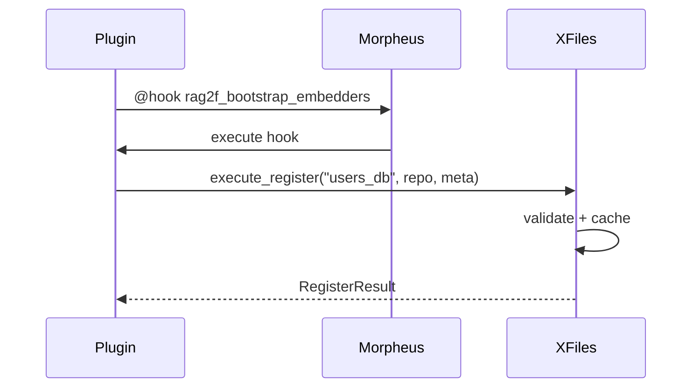
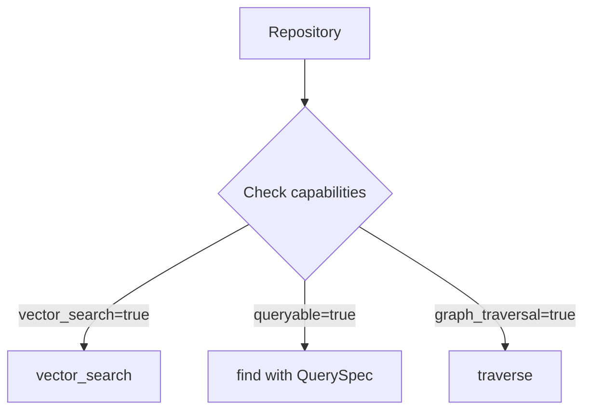

# Repositories (XFiles)

XFiles is rag2f’s registry for heterogeneous repositories: SQL, vector databases, document stores, graphs, or hybrids.

rag2f intentionally does **not** flatten every backend into a lowest-common-denominator API.
Instead, it defines **minimal contracts** and lets repositories opt into richer protocols.

> "The truth is out there."
> - The X-Files

## Registration Flow



## Repository protocols

A repository plugin implements one or more of these contracts:

- **BaseRepository**: minimal CRUD + capabilities + native escape hatch
- **QueryableRepository**: `find()` with `QuerySpec`
- **VectorSearchRepository**: `vector_search()` for embedding retrieval
- **GraphTraversalRepository**: `traverse()` for graph queries

Use **capabilities** to determine what you can safely call.

## Capabilities



> **Design Note:** Capabilities avoid the "lowest common denominator" problem: instead of forcing all repositories to implement methods they don't support (e.g. vector search on pure SQL), each repo explicitly declares what it can do. This makes plugins more honest and prevents runtime errors.

Repositories declare capabilities (e.g. supports vector search, supports graph traversal).
XFiles validates that the repository methods match the declared capabilities.

This makes it harder to:
- accidentally call vector search on a SQL-only repo,
- ship a plugin that claims features it doesn’t implement.

### Capability-driven calling

Before calling advanced methods, check capabilities or guard in your app:

```python
result = xfiles.execute_get("users_db")
if result.is_ok() and result.repository:
    repo = result.repository
    if repo.capabilities.get("vector_search"):
        repo.vector_search(...)
```

Example capability declaration (conceptual):

```python
capabilities = {
    "queryable": True,
    "vector_search": False,
    "graph_traversal": False,
}
```

## QuerySpec

Queryable repositories accept a `QuerySpec` structure to express filters, pagination and projection.
The exact shape lives in `rag2f.core.xfiles.types`, but conceptually:

```python
from rag2f.core.xfiles import QuerySpec, eq, and_

query = QuerySpec(
    select=["id", "email"],
    where=and_(eq("status", "active"), eq("tier", "pro")),
    order_by=["-created_at"],
    limit=10,
)
rows = repo.find(query)
```

## Minimal repository shape

At minimum, a repository should provide:

- `insert(data)` to add items
- `get(id)` to retrieve by identifier
- `update(id, data)` to modify
- `delete(id)` to remove
- `capabilities()` or `capabilities` metadata

If you implement richer protocols, document the expected payloads in your plugin README.

## Native access

For advanced use, repositories can expose native handles:

```python
client = repo.native("primary")
# now you're in backend-specific territory
```

This “escape hatch” is deliberate:
- rag2f keeps contracts minimal,
- you can still use vendor-specific power when you want it.

## Registering repositories

Repository registration is typically performed by plugins via XFiles hooks or explicit
registration calls (depending on your plugin design). Registration uses the Result
pattern, so check the returned `RegisterResult` instead of catching exceptions.

See [Architecture](architecture.md) for how XFiles sits in the overall system.

## API Reference

| Method | Description |
|--------|-------------|
| `execute_register(id, repo, meta=None)` | Register repository instance |
| `execute_get(id)` | Fetch repository by ID |
| `execute_search_by_meta(**criteria)` | Search repositories by metadata |
| `execute_search_by_capability(predicate)` | Search repositories by capability predicate |
| `has(id)` | Check existence |
| `list_ids()` | List all registered IDs |
| `unregister(id)` | Remove repository |
| `get_typed(id, protocol)` | Return repo only if it matches protocol |
| `get_meta(id)` | Get stored metadata |
| `get_capabilities(id)` | Get declared capabilities |

## Registration policy

- Same instance + same ID → OK (idempotent)
- Different instance + existing ID → error (use a new ID or unregister first)

## Repository metadata

Use metadata to help your app select the right backend:

```python
users_result = xfiles.execute_register(
    "users_db",
    users_repo,
    meta={"type": "postgresql", "domain": "users"},
)
if users_result.is_error():
    raise ValueError(users_result.detail.message)

papers_result = xfiles.execute_register(
    "papers",
    papers_repo,
    meta={"type": "vector", "domain": "research"},
)
if papers_result.is_error():
    raise ValueError(papers_result.detail.message)
```

Metadata is not enforced by the core, but it provides a stable filter surface for your application.
