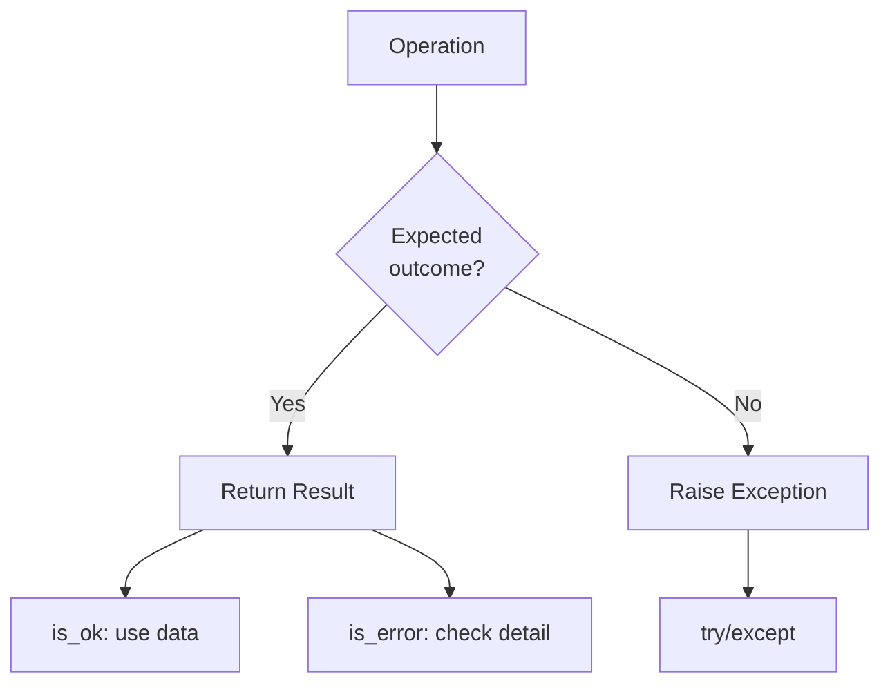

# Result Pattern

rag2f uses a typed Result pattern for expected outcomes. Exceptions are reserved for system errors only.

## Expected vs Exceptions



| Expected States | System Errors |
|-----------------|---------------|
| Empty input | Backend crash |
| Duplicate | Timeout |
| Not found | Connection failure |
| No results | Invariant violation |

## Status Codes

=== "Common"
    | Code | Meaning |
    |------|---------|
    | `EMPTY` | Input/query empty |
    | `INVALID` | Invalid format |
    | `NOT_FOUND` | Resource missing |

=== "Johnny5"
    | Code | Meaning |
    |------|---------|
    | `DUPLICATE` | Already processed |
    | `NOT_HANDLED` | No hook handled |

=== "IndianaJones"
    | Code | Meaning |
    |------|---------|
    | `NO_RESULTS` | Query returned nothing |
    | `DEGRADED` | Partial failure |

=== "XFiles"
    | Code | Meaning |
    |------|---------|
    | `ALREADY_EXISTS` | Key collision |
    | `CACHE_MISS` | Not in cache |

## Usage

```python
# Johnny5
result = rag2f.johnny5.execute_handle_text_foreground(text)
if result.is_ok():
    print(f"Stored: {result.track_id}")
else:
    print(f"Rejected: {result.detail.code}")  # empty, duplicate, not_handled

# IndianaJones  
result = rag2f.indiana_jones.execute_search(query)
if result.is_ok():
    print(result.response)

# XFiles
result = rag2f.xfiles.execute_get("vectors")
if result.is_ok() and result.repository:
    repo = result.repository
```
