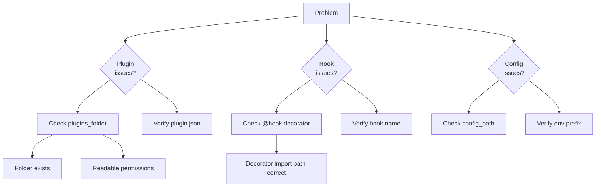

# Troubleshooting



## Debug Checklist

| Category | Check | Fix |
|----------|-------|-----|
| **Plugins** | `plugins_folder` exists | Pass correct path to `RAG2F.create()` |
| | `plugin.json` present | Create with valid `id` and `module` |
| | Entry point returns right path | Fix `get_plugin_path()` in plugin |
| **Hooks** | Function has `@hook` | Add decorator |
| | Hook name exact match | Check spelling and case |
| | Plugin activated | Check startup logs |
| **Config** | File path correct | Verify `config_path` |
| | Env prefix correct | Use `RAG2F__RAG2F__` or `RAG2F__PLUGINS__` |
| | Plugin namespace | Use `plugins.<plugin_id>.*` |
| **Embedders** | Default configured | Set `rag2f.embedder_default` |
| | Multiple registered | Remove extras or set default |
| **Repos** | Capability declared | Implement required methods |
| | Registry lookup | Check key casing, call `list_keys()` |

## Common Errors

=== "Plugin Issues"
    | Error | Cause | Solution |
    |-------|-------|----------|
    | Plugin not discovered | Missing folder or `plugin.json` | Verify path and metadata |
    | Entry point returns site-packages | Broken `get_plugin_path()` | Return plugin's own directory |
    | Duplicate hooks | Same plugin loaded twice | Uninstall duplicate or change id |

=== "Hook Issues"
    | Error | Cause | Solution |
    |-------|-------|----------|
    | Hook not running | Missing `@hook` decorator | Add decorator |
    | Wrong hook called | Name mismatch | Check exact hook name |
    | Runtime error in hook | Unhandled exception | Add try/except, check logs |

=== "Config Issues"
    | Error | Cause | Solution |
    |-------|-------|----------|
    | Value not found | Wrong path | Check `plugins.<id>` matches plugin id |
    | Env not applying | Wrong prefix | Use `RAG2F__SECTION__KEY` format |
    | No default embedder | Missing config | Set `rag2f.embedder_default` |

## Quick Diagnostics

```python
# Check plugin count
print(f"Plugins: {len(rag2f.morpheus.plugins)}")

# List registered embedders
print(f"Embedders: {rag2f.optimus_prime.list_keys()}")

# Check config loaded
print(f"Config loaded: {rag2f.spock.is_loaded}")

# List repositories
print(f"Repos: {rag2f.xfiles.list_keys()}")
```
